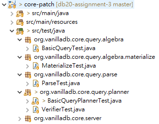
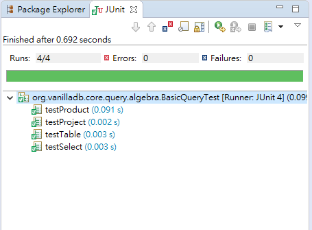

# Assignment 3
In this assignment, you are asked to implement the `Explain` SQL operation.

## Steps
To complete this assignment, you need to

1. Fork the Assignment 3 project
2. Trace the code in the `core-patch` project's `org.vanilladb.core.query` package yourself
3. Modify the current implementation of the query engine to support `Explain` keyword
4. Load the TPC-C testbed and run a few queries to test your implementation
5. Run the test cases we provide to make sure that you did not mess up anything
6. Write a report

## `Explain`
`Explain` is a special keyword that shows how a SQL statement is executed by dumping the execution plan chosen by the planner.

### Output

An output of `Explain` should be a record containing a value in the field `query-plan` with the type `varchar(500)`. A JDBC client will get the result through `RemoteResultSet.getString("query-plan")`

An output includes:
- A plan tree with the estimated number of blocks and records for each plan.
- Number of actually accessed records

For each plan, you should follow this format:

```
-> ${PLAN_TYPE} [optional information] (#blks=${BLOCKS_ACCESSED}, #recs=${OUTPUT_RECORDS})
```

### Example

Query
```sql
EXPLAIN SELECT COUNT(d_id) FROM district, warehouse WHERE d_w_id = w_id GROUP BY w_id
```

Sample Output
```
query-plan
----------------------------------------------------------------
->ProjectPlan  (#blks=2, #recs=1)
	->GroupByPlan: (#blks=2, #recs=1)
		->SortPlan (#blks=2, #recs=10)
			->SelectPlan pred:(d_w_id=w_id) (#blks=22, #recs=10)
				->ProductPlan  (#blks=22, #recs=10)
					->TablePlan on (warehouse) (#blks=2, #recs=1)
					->TablePlan on (district) (#blks=2, #recs=10)

Actual #recs: 1
```

Note that we indent each plan according to his hierarchical level in order to preserve the structure of the plan tree.

## Loading Testbed

We provide an improved benchmarker which contains a simplified version of TPC-C benchmarks. The TPC-C benchmarks is a industry-standard benchmarks which is often used to measure the performance of a DBMS under high pressure. It consists of 9 tables and 5 types of transactions. Because of its complicated schema, we provide it to you for generating data set.

You can find the schema in `org.vanilladb.bench.server.param.tpcc.TpccSchemaBuilderProcParamHelper` in project `bench`. You can also increase the size of testbed by adjusting property `org.vanilladb.bench.benchmarks.tpcc.TpccConstants.NUM_WAREHOUSES` in `vanillabench.properties`.

Here is instruction of loading testbed:

1. Start the benchmark server.
2. Start the benchmark client.
	- You don't have to adjust properties since we have done for you.
3. Wait for the loading procedure to finish.
	- Once it finishes, it will show `loading procedure finish` on server-side and the client will stop.
4. Stop the benchmark server.
5. Start the core server.
	- It means that you need to set the project and the main class as `core-patch` and `org.vanilladb.core.server.StartUp`, respectively.
	- Remember to use the same `[DB Name]` in order to load the same database.
6. Start our SQL intepretor.
7. Type in your SQL and see the results.

## Test cases

We also provide test cases for you. However, **the test cases are not used to test whether you finish the assignment**. They are just used to make sure everything alright.

You can find those test cases in `core-patch`:



There are 5 test classes. You can run a test class by right clicking on it, select `Run As` > `JUnit Test`. Then you should see this:



It tells us you pass the test cases.

Although these cases do not check if you implement `Explain` correctly, you still need to make sure your code can pass all these test cases when you sumbit your assignment. Please do not modify the test cases. (we will know it !)

## The Report
- How you implement `Explain` operation
- Use our `bench` project to load the TPC-C testbed and show the `EXPLAIN` result for the following queries:
  - A query accessing single table with `WHERE`
  - A query accessing multiple tables with `WHERE`
  - A query with `ORDER BY`
  - A query with `GROUP BY` and at least one aggregation function (`MIN`, `MAX`, `COUNT`, `AVG`... etc.)
  - (You can refer to the pages 12~16 of the slides of Lecture 3, `Architecture and Interfaces`, on [the course website](https://nthu-datalab.github.io/db/) for the avaliable queries in VanillaDB)
- Anything worth mentioning

	Note: There is no strict limitation to the length of your report. Generally, a 2~3 pages report with some figures and tables is fine. **Remember to include all the group members' student IDs in your report.**

## Note

- You can only modify the code in `org.vanilladb.core.query`. You are not allowed to modify other packages.

## Submission

The procedure of submission is as following:

1. Fork our [Assignment 3](https://shwu10.cs.nthu.edu.tw/courses/databases/2020-spring/db20-assignment-3) on GitLab
2. Clone the repository you forked
3. Finish your work and write the report
4. Commit your work, push your work to GitLab.
  - Name your report as `[Team Member 1 ID]_[Team Member 2 ID]_assignment3_report`
    - E.g. `103062563_103062528_assignment3_report.pdf`
5. Open a merge request to the original repository.
  - Source branch: Your working branch.
  - Target branch: The branch with your team number. (e.g. `team-1`)
  - Title: `Team-X Submission` (e.g. `Team-1 Submission`).

**Important: No late submission will be accepted.**

## No Plagiarism Will Be Tolerated

If we find you copy someone’s code, you will get 0 point for this assignment

## Hints

1. Here are the packages you may modify
  - `org.vanilladb.core.query.algebra`
  - `org.vanilladb.core.query.parse`
  - `org.vanilladb.core.query.planner`
2. Better start from `Parser` and `Lexer`
3. You may want to create a new plan and a new scan for `Explain`

## Deadline

Sumbit your work before **2020/05/03 (Sun.) 23:59:59**.
