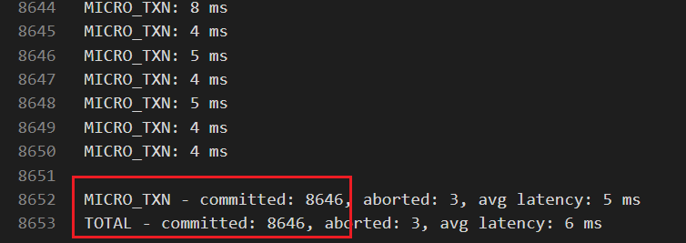

# Assignment 4

In this assignment, you are asked to optimize the file and buffer modules of VanillaCore.

## Steps

To complete this assignment, you need to

1. Fork the Assignment 4 project
2. Trace the code in `core-patch`'s `org.vanilladb.core.storage.file` and `org.vanilladb.core.storage.buffer` package
3. Modify the current implementation to reach better performance
4. Run test cases to ensure that you did not break anything
5. Run experiments using provided benchmark project
6. Write an experiment analysis report
7. Push your repository to Gitlab and open a merge request

## Main Objective: Optimization

The current file and buffer manager of VanillaCore are not optimized for multi-threading. We just wrap all public methods with `synchronized` to ensure thread-safty. The main objective of this assignment is to optimize these two modules for better performance.

## Constraints

Here are some constraints you must follow during coding

- You **can only** modify the code in these packages:
  - `org.vanilladb.core.storage.file`
  - `org.vanilladb.core.storage.buffer`
- You **can not** change the existing public APIs (public methods, public properties), but you can add new public methods for optimization.
- Your code must pass all the test cases (`Assignment4TestSuite`).

You must perform **at least one** optimization for each each module and show the overall improvement achieved by your optimization in the experiments.

If you follow the above rules and hand in your code along with your report in time, you will get at least 80% of scores. The rest of scores will be measured by how much you have done for optimization.

## Experiments

You need to run experiments to demonstrate how much performance your optimization improves. There are two types of experiments you must do:

- Show overall improvement
- Show improvement made by each optimization

This time we request you to record both throughput and average latency of each of your experiment. Also, you should show the results using plots, instead of tables.

`Attention:`
There are some tables having the exact same name across the Micro and the TPC-C benchmarks, so please clean the previous benchmark data before you switch to the other benchmark.

### Overall Improvement

First, you must run experiments with and without all your optimization to show the overall improvement in this assignment.

We suggest you to use `git` for switching between these versions.

### Improvement Made by Each Optimization

Then, for each optimization you performs, you should run experiments to show the improvement made by that particular optimization. Note that it is hard to show improvement for some optimization under some settings. Think about what kind of parameters are good for your work.

### Parameters

This time, we provide the TPC-C and a micro-benchmark to measure your performance. The micro-benchmark is very simliar to the benchmarker in assignment 2.

There are some parameters in the micro-benchmark you can adjust:

- `NUM_RTES` (value > 1) - The number of clients
- `RW_TX_RATE` (1.0 >= value >= 0.0) - The probability of generating a write transaction
- `TOTAL_READ_COUNT` (value >= 1) - The number of records read by a transaction
- `LOCAL_HOT_COUNT` (TOTAL_READ_COUNT >= value >= 0) - The number of **hot** records read by a transaction
- `WRITE_RATIO_IN_RW_TX` (1.0 >= value >= 0.0) - The ratio of writes to the total reads of a transaction
- `HOT_CONFLICT_RATE` (0.1 >= value >= 0.001) - The probability of a hot record conclicting with each other

For the TPC-C benchmark, we suggest you to only ajdust this parameter:

- `NUM_WAREHOUSES` - The number of warehouses used in the experiment. This also controls the conflict rate since transactions have less chance to conflict as there are more warehouses.

There is also a configuration in VanillaCore you can try:

- `BUFFER_POOL_SIZE` (value > 1) - The size of buffer pool

Note that it is hard to see the effect of the optimization for `org.vanilladb.core.storage.file` when VanillaCore has a large buffer pool because it makes VanillaCore seldom fetch data from disks.

### Notes

#### Recording only the committed transactions

The detailed report now shows both the committed and aborted transactions. When you record the results on your report, remember to use only the number of the committed transactions.

#### Using a fresh database every time

Some benchmarks will change the database (e.g., TPC-C). We recommend to back up your database after you finish loading a fresh database. Before each time you run a experiment, recovery the database by replacing the database using your backup.

## The report

- Briefly explain what you exactly do for optimization
- Experiments
  - Your experiement enviornment including (a list of your hardware components, the operating system)
    - e.g. Intel Core i5-3470 CPU @ 3.2GHz, 16 GB RAM, 128 GB SSD, CentOS 7
  - The benchmarks and the parameters that you use for your experiments.
  - The experiments showing the overall improvement
  - The experiments showing the improvement made by each of your optimization
  - Analyze and explain the result of the experiments
- **Discuss and conclude why your optimization works**

	Note: There is no strict limitation to the length of your report. Generally, a 2~3 pages report with some figures and tables is fine. **Remember to include all the group members' student IDs in your report.**

## Submission

The procedure of submission is as following:

1. Fork our [Assignment 4](https://shwu10.cs.nthu.edu.tw/courses/databases/2020-spring/db20-assignment-4) on GitLab
2. Clone the repository you forked
3. Finish your work and write the report
4. Commit your work, push your work to GitLab.
  - Name your report as `[Team Member 1 ID]_[Team Member 2 ID]_assignment4_report`
    - E.g. `102062563_103062528_assignment4_report.pdf`
5. Open a merge request to the original repository.
  - Source branch: Your working branch.
  - Target branch: The branch with your team number. (e.g. `team-1`)
  - Title: `Team-X Submission` (e.g. `Team-1 Submission`).

**Important: We do not accept late submission.**

## No Plagiarism Will Be Tolerated

If we find you copy someone’s code, you will get 0 point for this assignment.

## Demo

Due to the complexity of this assignment, we hope you can come to explain your work face to face. We will announce a demo time registration table after submission. Don't forget to choose the demo time for your team.

## Hints

### Smaller Critical Section

Critical sections are usually used to protect some shared resource

- Reducing the size of critical sections usually makes transaction have less chance to block each other
- Some kinds of transactions will be stalled during execution due to some critical sections, even if they do not need to use those resource
- Java standard library provides lots of convenient data structures that optimized for multi-threading. You can find them in `java.util.concurrent`.

### Never Do It Again

Some works may take lots of time, such as calculating hash code for a `BlockId`. Part of them may stay unchanged in the future, but the program still repeatedly calculate them when we need them. Those values only need to be calculated once and could be cached to avoid repeated calculation.

### Replacement Strategy

Maybe using a different replacement strategy in `BufferPoolMgr` results in better performance. However, it is not easy to show the improvement in the experiments.

## Deadline

Sumbit your work before **2020/05/17 (Sun.) 23:59:59**.
